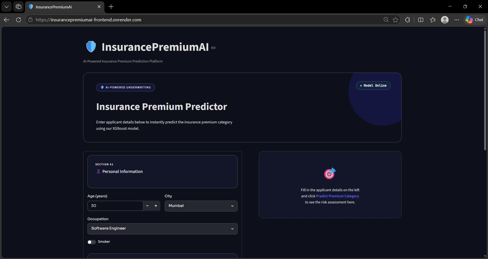
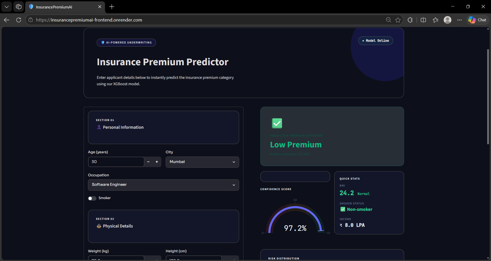
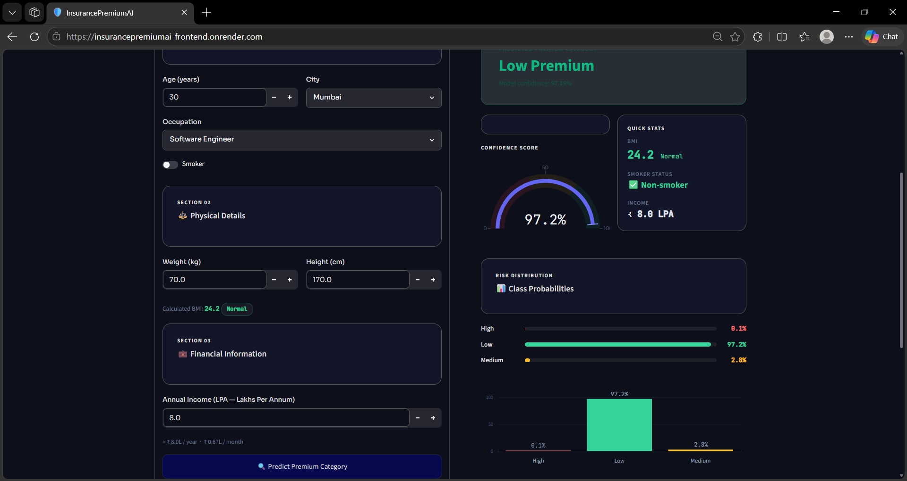
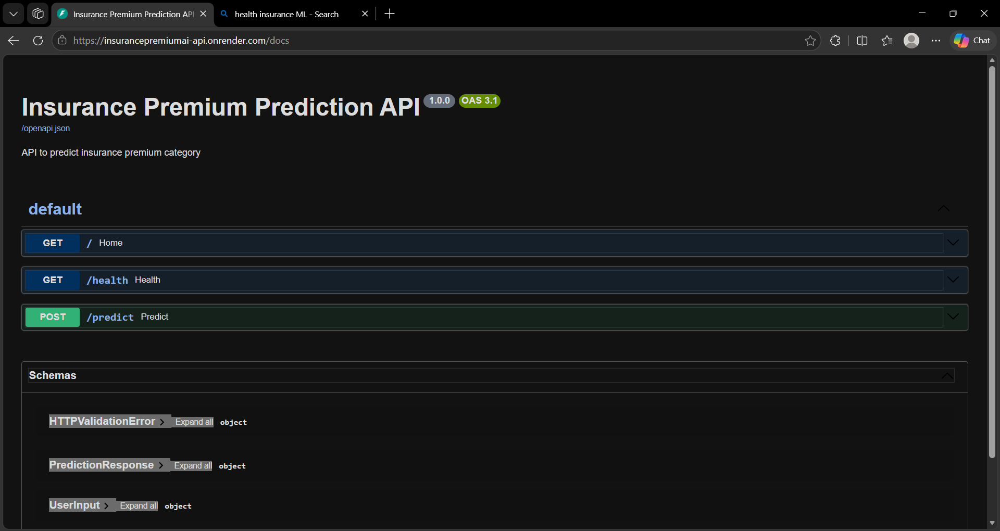

# 🛡️ InsurancePremiumAI

An end-to-end Machine Learning application that predicts insurance premium categories using **XGBoost**, **FastAPI**, **Streamlit**, **Docker**, and **Render**.

## 🚀 Live Demo

**Web Application**
https://insurancepremiumai-frontend.onrender.com

**API Documentation**
https://insurancepremiumai-api.onrender.com/docs

---

## 📌 Overview

InsurancePremiumAI predicts insurance premium categories based on customer demographics, lifestyle factors, and financial information.

The project demonstrates a complete ML deployment workflow, including model development, API creation, containerization, cloud deployment, and interactive visualization.

---

## 🛠️ Tech Stack

* Python
* XGBoost
* Pandas & NumPy
* FastAPI
* Streamlit
* Plotly
* Docker & Docker Compose
* GitHub
* Render

---

## 🏗️ Architecture

```text
User
 ↓
Streamlit Dashboard
 ↓
FastAPI REST API
 ↓
Feature Engineering
 ↓
XGBoost Model
 ↓
Premium Prediction
```

---

## ✨ Features

* Insurance Premium Prediction
* Real-Time Inference
* Confidence Score Analysis
* Interactive Dashboard
* REST API Integration
* Dockerized Deployment
* Cloud Hosted on Render

---

## 📸 Screenshots

### Dashboard



### Prediction Result



### Risk Analysis



### API Documentation



---

## ⚙️ Run Locally

```bash
git clone https://github.com/kaushik238P/InsurancePremiumAI.git

cd InsurancePremiumAI

docker compose up --build
```

---

## 🌐 Deployment

| Service     | URL                                              |
| ----------- | ------------------------------------------------ |
| Frontend    | https://insurancepremiumai-frontend.onrender.com |
| Backend API | https://insurancepremiumai-api.onrender.com      |
| API Docs    | https://insurancepremiumai-api.onrender.com/docs |

---

## 👨‍💻 Author

**Kaushik Bairwa**
B.Tech, SVNIT Surat

⭐ If you found this project useful, consider starring the repository.
